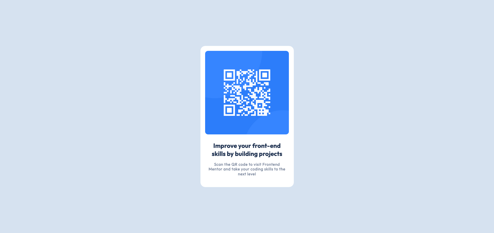

# Frontend Mentor - QR code component solution

This is a solution to the [QR code component challenge on Frontend Mentor](https://www.frontendmentor.io/challenges/qr-code-component-iux_sIO_H). Frontend Mentor challenges help you improve your coding skills by building realistic projects. 

## Table of contents

- [Overview](#overview)
  - [Screenshot](#screenshot)
  - [Links](#links)
- [My process](#my-process)
  - [Built with](#built-with)
  - [What I learned](#what-i-learned)
  - [Continued development](#continued-development)
- [Author](#author)

**Note: Delete this note and update the table of contents based on what sections you keep.**

## Overview

### Screenshot

### Links

- Solution URL: [Add solution URL here](https://your-solution-url.com)

## My process

### Built with

- Vanilla HTML5 and CSS
- Flexbox

### What I learned

This was a pretty straight-forward project, and was fairly easy. 

### Continued development

I could not figure out how to get the box-shadow to match up with the design, so I decided to omit it.

## Author

- Frontend Mentor - [@yourusername](https://www.frontendmentor.io/profile/tadaly04)
